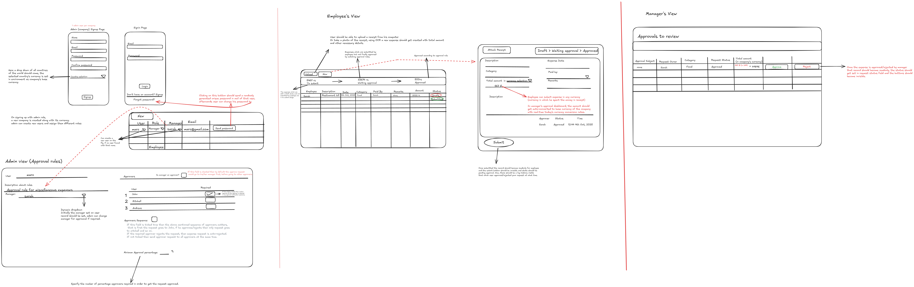

# ExpenseFlow - Enterprise Expense Management System

A modern, production-ready expense management platform built with React, TypeScript, and Tailwind CSS. Features multi-role approval workflows, real-time analytics, and a professional UI.



## Features

### For Employees
- Submit and track expense claims with receipt uploads
- View expense history and status
- Dashboard with spending overview
- Export reports to CSV

### For Managers
- Approve/reject expense claims
- View team spending analytics
- Audit trail for all decisions

### For Administrators
- Configure approval workflows
- Manage expense categories and budgets
- Team member management (CRUD)
- Comprehensive analytics dashboard
- System settings

### Key Features
- Multi-role authentication (Employee, Manager, Admin, CFO)
- Approval workflow configuration
- Real-time expense tracking
- Rich analytics and reporting
- Responsive design (mobile-first)
- Dark/light theme support
- Receipt OCR integration ready
- Multi-currency support

## Tech Stack

- **Frontend**: React 18, TypeScript, Vite
- **Styling**: Tailwind CSS
- **Charts**: Recharts
- **Routing**: React Router DOM
- **Icons**: Lucide React
- **Backend**: Node.js, Express
- **Database**: PostgreSQL
- **Auth**: JWT, bcrypt
- **OCR**: Tesseract.js (optional)

## Project Structure

```
odoo-hackathon/
├── frontend/
│   ├── src/
│   │   ├── components/
│   │   │   ├── ui/           # Reusable UI components
│   │   │   ├── Layout.tsx     # Main app layout
│   │   │   ├── ProfileModal.tsx
│   │   │   ├── ExpenseDetailModal.tsx
│   │   │   ├── AddExpenseModal.tsx
│   │   │   └── AddExpenseModalEnhanced.tsx
│   │   ├── pages/
│   │   │   ├── LandingPage.tsx      # Public landing page
│   │   │   ├── Login.tsx          # Authentication
│   │   │   ├── EmployeeDashboard.tsx
│   │   │   ├── ManagerApprovals.tsx
│   │   │   ├── ReportsPage.tsx
│   │   │   ├── AnalyticsPage.tsx
│   │   │   ├── CategoriesPage.tsx
│   │   │   ├── UsersPage.tsx
│   │   │   ├── NotificationsPage.tsx
│   │   │   ├── HelpPage.tsx
│   │   │   ├── SettingsPage.tsx
│   │   │   ├── AdminPanel.tsx
│   │   │   ├── FeaturesPage.tsx
│   │   │   ├── PricingPage.tsx
│   │   │   ├── AboutPage.tsx
│   │   │   └── ContactPage.tsx
│   │   ├── context/
│   │   │   └── AuthContext.tsx    # Authentication state
│   │   ├── store/
│   │   │   └── useExpenseStore.ts
│   │   ├── services/
│   │   │   ├── api.ts
│   │   │   ├── ocrService.ts
│   │   │   └── currencyService.ts
│   │   ├── types/
│   │   │   └── index.ts
│   │   └── constants/
│   │       └── avatars.ts
│   └── public/
│       └── assets/avatars/
├── database/
│   ├── db/
│   │   ├── init.sql
│   │   └── seed.sql
│   └── README.md
└── docs/
    └── image.png
```

## Getting Started

### Prerequisites

- Node.js 18+
- npm or yarn
- PostgreSQL (local or Supabase)

### Installation

1. **Clone the repository**
   ```bash
   git clone <repository-url>
   cd odoo-hackathon
   ```

2. **Install frontend dependencies**
   ```bash
   cd frontend
   npm install
   ```

3. **Configure environment**
   ```bash
   cp .env.example .env
   ```

   Edit `.env` with your Supabase credentials:
   ```
   VITE_SUPABASE_URL=your_supabase_url
   VITE_SUPABASE_ANON_KEY=your_anon_key
   ```

4. **Start development server**
   ```bash
   npm run dev
   ```

5. **Open browser**
   Navigate to `http://localhost:5173`

### Building for Production

```bash
cd frontend
npm run build
```

The production build will be in `frontend/dist/`

### Running Tests

```bash
npm run lint      # ESLint
npm run typecheck # TypeScript
```

## Quick Start (Development)

### Option 1: Docker (Recommended)

```bash
# Start all services
docker-compose up -d

# Or rebuild and start
docker-compose up --build
```

Access:
- Frontend: http://localhost:5173
- Backend API: http://localhost:3001
- Database: localhost:5432

### Option 2: Manual Setup

#### 1. Set up Database
```bash
# Connect to PostgreSQL and run schema
cd database
psql -U postgres -d expenseflow -f db/init.sql
psql -U postgres -d expenseflow -f db/seed.sql
```

#### 2. Start Backend
```bash
cd backend
cp .env.example .env  # Configure your database credentials
npm install
npm run dev  # Runs on http://localhost:3001
```

#### 3. Start Frontend
```bash
cd frontend
cp .env.example .env  # Configure your API URL
npm install
npm run dev  # Runs on http://localhost:5173
```

## User Roles & Permissions

| Role | Dashboard | Approvals | Reports | Analytics | Categories | Users | Admin |
|------|----------|----------|---------|-----------|----------|-------|-------|
| Employee | ✓ | - | ✓ | - | - | - | - |
| Manager | ✓ | ✓ | ✓ | ✓ | - | - | - |
| Admin | ✓ | ✓ | ✓ | ✓ | ✓ | ✓ | ✓ |

## Routes

| Path | Page | Access |
|------|------|--------|
| `/` | Landing | Public |
| `/login` | Login | Public |
| `/dashboard` | My Expenses | Employee+ |
| `/expenses` | My Expenses | Employee+ |
| `/approvals` | Manager Approvals | Manager+ |
| `/reports` | Reports | Employee+ |
| `/analytics` | Analytics | Manager+ |
| `/categories` | Categories | Admin |
| `/users` | Team | Admin |
| `/notifications` | Notifications | Employee+ |
| `/help` | Help | Employee+ |
| `/settings` | Settings | Employee+ |
| `/admin` | Admin Panel | Admin |

## Database Schema

### Core Tables

- `users` - User accounts
- `expenses` - Expense claims
- `approvals` - Approval records
- `approval_flows` - Workflow configurations
- `categories` - Expense categories

### Quick Database Setup

```bash
cd database
# Run init.sql to create tables
# Run seed.sql to add sample data
```

## Configuration

### Adding/Managing Categories

1. Navigate to `Categories` in the admin panel
2. Click "Add Category"
3. Set name, color, and optional monthly budget
4. Save

### Setting Up Approval Workflows

1. Go to `Admin Panel`
2. Create approval flow with multiple steps
3. Define approvers per step

## API Integration

The backend API runs on port 3001. Key endpoints:

### Authentication
- `POST /api/auth/signup` - Register new user
- `POST /api/auth/login` - Login and get JWT token

### Expenses
- `GET /api/expenses` - List user expenses
- `POST /api/expenses` - Create expense
- `GET /api/expenses/:id` - Get expense details
- `PUT /api/expenses/:id` - Update expense
- `DELETE /api/expenses/:id` - Delete expense
- `POST /api/expenses/:id/upload` - Upload receipt

### Approvals
- `GET /api/approvals` - List pending approvals (manager)
- `POST /api/approvals/:id/approve` - Approve expense
- `POST /api/approvals/:id/reject` - Reject expense

### Currency
- `GET /api/currency/rates` - Get exchange rates

### OCR
- `POST /api/ocr/extract` - Extract text from receipt image

## Contributing

1. Fork the repository
2. Create a feature branch (`git checkout -b feature/xyz`)
3. Commit changes (`git commit -m 'Add feature xyz'`)
4. Push to branch (`git push origin feature/xyz`)
5. Create a Pull Request

## License

MIT License - See LICENSE file for details

## Support

- Documentation: `/help` page in the app
- Email: support@expenseflow.com
- Phone: 1-800-EXPENSE

## Docker Deployment

```bash
# Start all services
docker-compose up -d

# View logs
docker-compose logs -f

# Stop services
docker-compose down
```

## Troubleshooting

### Database Connection Failed
- Check PostgreSQL is running: `docker-compose ps`
- Verify credentials in `.env` file
- Check firewall rules allow port 5432

### Backend API Errors
- Verify database is accessible: `psql -h localhost -U postgres`
- Check JWT_SECRET is set in `.env`
- Review logs: `docker-compose logs backend`

### Frontend Not Loading
- Check backend is running: `curl http://localhost:3001/health`
- Verify CORS_ORIGIN includes your URL

## Production Checklist

- [ ] Change JWT_SECRET to unique secure value
- [ ] Configure database credentials
- [ ] Set production CORS origins
- [ ] Enable SSL/HTTPS
- [ ] Set up backup strategy
- [ ] Configure logging

## Acknowledgments

- [Tailwind CSS](https://tailwindcss.com)
- [Lucide Icons](https://lucide.dev)
- [Recharts](https://recharts.org)
- [Express.js](https://expressjs.com)
